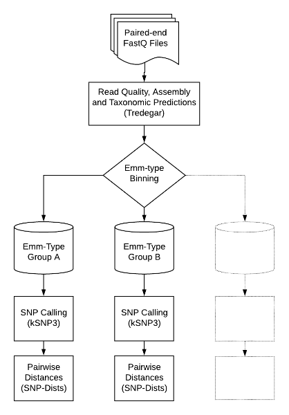
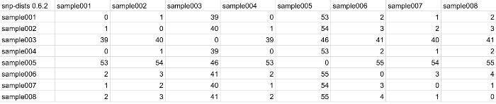

# Foushee v1.0
Bioinformatics pipeline for reference-free SNP analysis of Group-A *Streptococcus* (GAS) isolates

## Data workflow:


## Reference-free SNP analysis for GAS isolates of same emm-type
Read quality assessment, genome assembly, and taxonomic predictions (including GAS emm-type) are performed for all input data using [Tredegar](https://staph-b.github.io/staphb_toolkit/#/tredegar-README), a QC workflow within the StaPH-B tookit. Tredegar results are used to group isolates by emm-type before performing reference-free Single-Nucleotide Polymorphism (SNP) analysis on each emm-type group independently using [kSNP3](https://www.ncbi.nlm.nih.gov/pubmed/25913206). The resulting core_SNPs_matrix.fasta file is used to generate a pairwise SNP distance matrix using [snp-dists](https://github.com/tseemann/snp-dists). 

---

## Quick Start: 

````
$ staphb_toolkit_workflows foushee.py <input_dir> -o <output_dir>
````

`<input_dir>` can be the path to an input directory containing paired-end fastq read data or path to a mounted BaseSpace project.
If an `<output_dir>` is not provided, results will be written to a `foushee_run_<date>` directory.


## Other Options
- -c: path to alternate configuration file, default set to staphb_toolkit/workflows/foushee/foushee_config.json
- -t: number of cpus to use, defaults to 8
- -m: number of GB of memory to use, defaults to 16


## Output: 
Foushee will organize ksnp3 and snp-dists output in a `<tool>_output` subdirectories within the `<output_dir>`, where `<tool>` is the name of the bioinformatics tool used to generate the results, i.e. either ksnp3 or snps-dists. If more than one file is generated by a tool, a second subdirectory will be made within the `<tool>_output` directories for each emm group identified in the input data. E.g. ksnp3 reults for a Foushee in which isolates were categorized as either emm89 or emm1 will be organized like this: 

`````
$tree ksnp3_output

ksnp3_output/
├── emm89
    ├── annotate_list
    ├── core_SNPs
    ├── core_SNPs_matrix
    ├── core_SNPs_matrix.fasta
    ├── COUNT_coreSNPs
    ├── COUNT_SNPs
    ├── emm89_assemblies.txt
    ├── fasta_list
    ├── nonCore_SNPs
    ├── SNPs_all
    ├── SNPs_all_matrix
    ├── SNPs_all_matrix.fasta
    ├── SNPs_in_majority0.5
    ├── TemporaryFilesToDelete
    ├── tree.core.tre
    ├── tree.parsimony.tre
    └── unresolved_clusters
├── emm1
    ├── annotate_list
    ├── core_SNPs
    ├── core_SNPs_matrix
    ├── core_SNPs_matrix.fasta
    ├── COUNT_coreSNPs
    ├── COUNT_SNPs
    ├── emm89_assemblies.txt
    ├── fasta_list
    ├── nonCore_SNPs
    ├── SNPs_all
    ├── SNPs_all_matrix
    ├── SNPs_all_matrix.fasta
    ├── SNPs_in_majority0.5
    ├── TemporaryFilesToDelete
    ├── tree.core.tre
    ├── tree.parsimony.tre
    └── unresolved_clusters

`````

The ksnp3 core tree files (`<emm_group>_tree.core.tre`) and snps-dists pairwise SNP distance matrix files (`<emm_group>_pairwise_snp_distance_matrix.tsv`) generated will be hard linked into a `foushee_output` subdirectory along with a log file to assist in troubleshooting and output config file detailing run parameters.
 
 Visualization of the ksnp3 core tree file can be done using phylogenetic tree viewers such as the web-accessible [Interacative Tree of Life](https://itol.embl.de) or a local copy of [FigTree](http://tree.bio.ed.ac.uk/software/figtree/). The snps-dists pairwise SNP distance matrix file can be viewed on any spreadsheet software (e.g. Microsoft Excel or LibreOffice Calc).

## Sample Outpt


**Sample kSNP Core Tree:** visualized with the Interact of Tree of Life web application





**Sample snp-dists pairwise SNP distance matrix:** visualized with LiberOffice Calc
