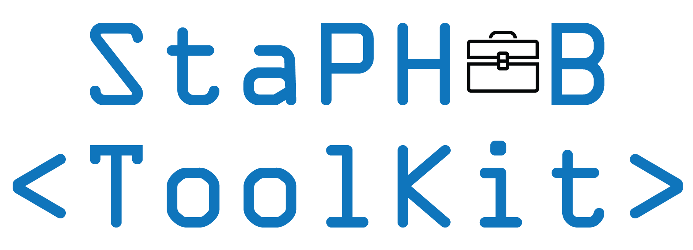

Public health bioinformatics is dependent on open-source software that require carefully curated computational environments and various software dependencies. Setting up and maintaining such environments requires a skill set and expertise absent in most public health laboratories. The [StaPH-B Docker Images](https://github.com/StaPH-B/docker-builds) have helped generate reproducible computational environments through the use of containerization. However, access to these images is dependent on a working understanding of Linux operating systems and containerization, which is not available in most laboratories. The ToolKit addresses this limitation by allowing users to interact with bioinformatis programs without needing to interact directly with mounted file systems and running containers. The goal of the Toolkit is it increase usability while mirroring the functionality of a locally-installed tool.

Additionally, the StaPH-B ToolKit will provide a single repository for public health bioinformatics scientists to package and distribute custom analytical workflows for specific public health use-cases.

The StaPH-B ToolKit is a Python application (Python 3.6) that utilizes modern workflow approach [Nextflow](https://www.nextflow.io/) alongside containerization via [Docker](https://www.docker.com/) or [Singularity](https://sylabs.io) of commonly used bioinformatics tools that help to inform public health action. The StaPH-B ToolKit utilizes the StaPH-B Docker Images to enable easy access of open-source software without the need of local installation and/or dependency maintenance.

This tool was developed and tested for use on an Ubuntu/Debian OS. However, the tool could also be used on other Linux/Unix and MacOS systems as long as the dependencies are met.

## Usage Guide
  * [Installing](/staphb_toolkit/install)
  * [Using the Toolkit](/staphb_toolkit/using_tk)
  * [Default Docker Images](/staphb_toolkit/default_images)
  * [Running Workflows](/staphb_toolkit/workflows)
    - [Cutshaw](/staphb_toolkit/workflows_docs/cutshaw)
    - [Dryad](/staphb_toolkit/workflow_docs/dryad)
    - [Foushee](/staphb_toolkit/workflow_docs/foushee)
    - [Monroe](/staphb_toolkit/workflow_docs/monroe)
    - [Tredegar](/staphb_toolkit/workflow_docs/tredegar)
  * [Custom Configurations](/staphb_toolkit/configs)
